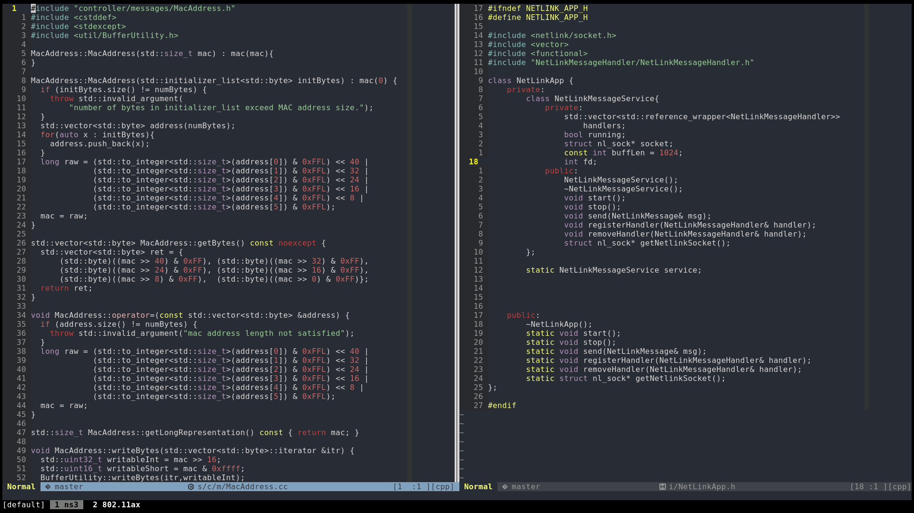

# nvim-gruvbox

Heavily inspired from [tjdevries/gruvbuddy.nvim](https://github.com/tjdevries/gruvbuddy.nvim)

(My desired changes to gruvbuddy.)

Gruvbox escape sequenced colorscheme.



This plugin is also an example of how easy it is to customize and make new colorschemes based on `colorbuddy`.

Check out `lua/nvim-gruvbox.lua`

## Installation

```vim
Plug 'tjdevries/colorbuddy.vim'
Plug 'RishabhRD/nvim-gruvbox'

" And then somewhere in your vimrc, to set the colorscheme
lua require('colorbuddy').colorscheme('nvim-gruvbox')
```
